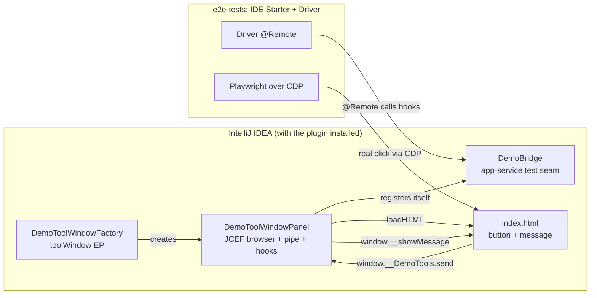
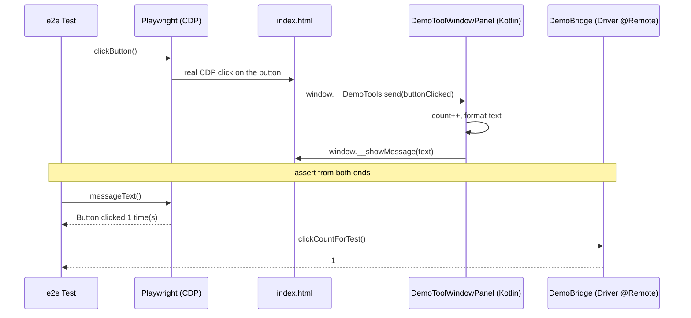
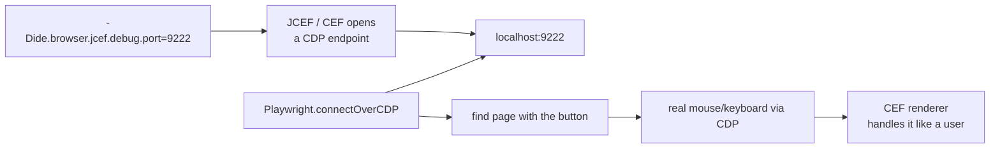

# JCEF + Playwright E2E Example

A minimal IntelliJ Platform plugin that demonstrates how to **end-to-end test a JCEF (Chromium
Embedded) UI** using JetBrains' modern **IDE Starter + Driver** framework together with
**Playwright** attached over the Chromium DevTools Protocol (CDP).

The plugin itself is intentionally tiny: a **tool window** hosting a small HTML page with a button.
Clicking the button round-trips through the browser pipe to Kotlin and back to display a message
(`button click → window.__DemoTools.send → Kotlin → window.__showMessage`). The interesting part is the
**`e2e-tests/`** harness, which drives that button with a **real Playwright gesture over CDP** and then
asserts the round-trip from both ends: the page-visible message **and** that Kotlin actually observed
the click. That JS↔Kotlin round-trip is what makes this a meaningful *plugin* test — Playwright drives
a genuine click, and we verify it reached the Kotlin handler and the handler's response reached the page.

> Scope: the **same tests run in both architectures** — the classic monolith IDE (`e2eTest`) and V2
> **split mode** / remote development (`e2eTestSplitMode`, a backend host + JetBrains Client). The
> tool window lives in a **frontend content module**, the idiomatic placement for new UI surfaces
> now that JetBrains is pushing V2 split mode — and the punchline is that the Playwright/CDP layer
> itself needs **zero changes** for split; only the harness plumbing differs (see "Split mode").

## Architecture



- **`DemoToolWindowFactory`** registers the tool window (the `com.intellij.toolWindow` EP). When the
  tool window is shown, it creates the panel.
- **`DemoToolWindowPanel`** owns the `JBCefBrowser`, installs the **browser pipe** (a `JBCefJSQuery`
  exposed to JS as `window.__DemoTools.send`), handles incoming messages, and pushes results back to
  the page with `window.__showMessage`. It also exposes `@TestOnly` hooks the test reads: a render
  latch (`hasRenderedForTest`) and the observed click count (`clickCountForTest`).
- **`DemoBridge`** is a tiny `@Service(APP)` **test seam**: the panel registers itself on creation, so
  the Driver `@Remote` stub can reach the live panel's hooks (a tool-window panel instance is otherwise
  hard to resolve through the platform object graph).
- **`index.html`** is the JCEF page: a button and a message element, wired to the pipe.

## How the gesture test works



One real gesture, asserted from both ends: Playwright reads the page-visible `#message` (proving
Kotlin's response reached the page), and the Driver reads `DemoBridge.clickCountForTest()` (proving the
click actually round-tripped to Kotlin). Driving the gesture for real is what exercises the JS click
handler + the pipe it fires — a JS-only button would tell us nothing about the plugin integration.

## Attaching Playwright to JCEF over CDP

JCEF is Chromium under the hood, so it can expose a standard DevTools Protocol endpoint. Launch the
IDE with `-Dide.browser.jcef.debug.port=<port>` and Playwright's `connectOverCDP` attaches to the
**already-running** CEF — no Playwright-managed browser is downloaded. CDP input is dispatched into
the renderer, so it works even for off-screen-rendered browsers.



## Split mode (V2 remote development)

Under split mode the IDE is two processes: a **backend host** (project model, indexes, PSI) and the
**JetBrains Client** frontend (the UI the user sees). Where your JCEF browser runs is decided by
**module placement**, and everything else follows from that:

- The tool window, panel, and bridge live in the `frontend/` **content module**, whose descriptor
  (`dev.example.jcefe2e.frontend.xml`) declares
  `<dependencies><module name="intellij.platform.frontend"/></dependencies>`. That dependency is the
  platform's *loading marker*: the module loads in a monolith IDE and in the JetBrains Client, but
  not on a split backend — the backend log literally prints
  `Module 'intellij.platform.frontend' is not available in 'backend' product mode` and skips it. So
  in split mode the JCEF browser runs **client-side**, exactly once, with no backend duplicate.
- **The CDP port follows the browser.** `-Dide.browser.jcef.debug.port` must go on the process that
  owns the JCEF browser — and *only* that one (two IDE processes would race to bind a fixed port).
  Here that is the frontend context in split, the single context in monolith
  (`DemoE2ETestBase.newDemoContext`). If your browser is backend-resident instead (e.g. a custom
  file editor, which is always backend-OSR for installed plugins), put the port on the backend
  context — the Playwright side is identical either way.
- **Playwright needs nothing else.** `connectOverCDP` attaches to whichever process exposes the
  port; CDP input dispatches into the renderer, so OSR vs windowed and monolith vs split make no
  difference to the gesture code.

The harness deltas that make the split task real (all in `DemoE2ETestBase` / the root build):

1. **Bind `DriverRunner` explicitly.** In Starter 253, `runIdeWithDriver` resolves `DriverRunner`
   via `instanceOrNull` and silently falls back to `LocalDriverRunner`: the JetBrains Client sandbox
   is provisioned but never launched, and the "split" run is actually a monolith that can stay green
   for months without testing split at all. The base class binds
   `if (ConfigurationStorage.splitMode()) RemDevDriverRunner() else LocalDriverRunner()` (once per
   JVM — Kodein throws `OverridingException` on a duplicate binding).
2. **Install the plugin on BOTH processes.** The split context is an `IDERemDevTestContext` whose
   `frontendIDEContext` is a *separate* context; a single `PluginConfigurator` call only reaches the
   backend. The Gradle task also sets `pluginInstallationTarget = BOTH`.
3. **`REMOTE_DEV_RUN=true` + `splitMode = true`** on the `e2eTestSplitMode` task switch Starter into
   remote-dev provisioning (the env var is read via `System.getenv`, so it must be an env var).

`@Remote` targeting: the Driver defaults to the **frontend** in split mode, which is exactly where
this plugin's `DemoBridge` lives — so the stub needs no explicit `RdTarget`. It does need the
**content-module plugin id** form, `"dev.example.jcefe2e/dev.example.jcefe2e.frontend"` (a bare
plugin id only resolves classes in the plugin's main module). If your service lives on the backend
instead, resolve it with `RdTarget.BACKEND` when `driver.isRemDevMode`.

## Running the tests

```bash
./gradlew e2eTest            # monolith (single IDE process)
./gradlew e2eTestSplitMode   # split: backend host + JetBrains Client, same tests
```

Each builds the plugin, launches a real IntelliJ IDEA with it installed, runs the two test classes,
and shuts down. The first run downloads the IDE under test (cached afterwards).

- **`DemoSmokeTest`** — opens the tool window, confirms the JCEF page renders, and (via the
  `CIServer` override) fails on any IDE-side exception.
- **`DemoGestureTest`** — drives a real Playwright click; asserts the page message and that Kotlin
  observed the click.

**Environment:** the tests launch a real IDE with a JCEF (Chromium) browser, so they need an active
desktop session. Gestures go through CDP (dispatched into the renderer, not the OS), so no special
input permissions are required. On a headless Linux CI, run under a virtual display such as `Xvfb`.

## Why the `testIdeUi` task lives in the root build

The IntelliJ Platform Gradle plugin **rejects `testIdeUi` in `.module` projects**, and the root is
where the plugin-under-test is built. So `e2e-tests/` holds only the harness + tests (with the
JUnit5 / Starter / Playwright dependencies kept off the main classpath), and the **root**
`build.gradle.kts` registers the `e2eTest` and `e2eTestSplitMode` tasks, pulling `e2e-tests`'s compiled classes + runtime
classpath through two resolvable configurations (pure dependency resolution → configuration-cache
safe). A distinguishing attribute disambiguates them from the module's default `runtimeElements`.

## Key files

| File | Role |
|------|------|
| `src/main/resources/META-INF/plugin.xml` | Main descriptor: declares the `frontend` content module (no EPs of its own). |
| `frontend/src/main/resources/dev.example.jcefe2e.frontend.xml` | Frontend module descriptor: `intellij.platform.frontend` dependency (the loading marker) + the `Demo` tool window EP. |
| `frontend/.../DemoToolWindowFactory.kt` | The `toolWindow` EP factory. |
| `frontend/.../DemoToolWindowPanel.kt` | JCEF browser + browser pipe + `@TestOnly` hooks. |
| `frontend/.../DemoBridge.kt` | `@Service(APP)` test seam the Driver binds to. |
| `frontend/src/main/resources/demo-preview/index.html` | The JCEF page (button + message). |
| `e2e-tests/.../DemoE2ETestBase.kt` | Starter context, `CIServer` override, `DriverRunner` binding, per-process CDP port, launch helpers. |
| `e2e-tests/.../DemoDriverSupport.kt` | Driver `@Remote` stub for `DemoBridge`, tool-window activation. |
| `e2e-tests/.../PlaywrightPreviewSupport.kt` | `connectOverCDP` attach + gesture helpers (identical in both modes). |
| `e2e-tests/.../Demo{Smoke,Gesture}Test.kt` | The smoke + Playwright gesture tests (run unmodified in both modes). |
| `build.gradle.kts` (root) | Plugin build + the root-owned `e2eTest` / `e2eTestSplitMode` `testIdeUi` tasks. |
